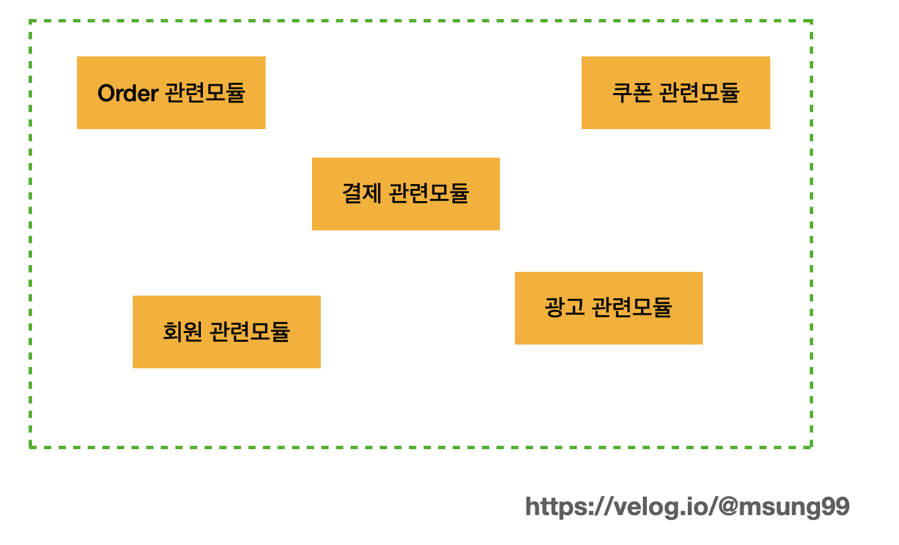

# QueryDSL 이란?

<figure><figcaption></figcaption></figure>

QueryDSL은 한마디로 `SQL`, `JPQL 등을 코드로 작성할 수 있도록 해주는 빌더 오픈소스 프레임워크` 입니다.

사실, QueryDSL이 JPA 에서만 사용하는 프레임워크로만 알 수도 있지만


[공식 사이트](http://querydsl.com/) 를 보면 JPA 뿐만 아니라 SQL, Mongodb, Lucenece 등 다양한 언어에 대해서 서비스를 제공한다.

이번엔 JPA 를 사용할 때 함께 많이 사용하는 QueryDSL JPA 에 대해서 알아보겠습니다.


### QueryDSL JPA

QueryDSL JPA는

1. SQL, JPQL 을 코드로 작성할 수 있도록 해주는 빌더 API 이고,
2. Entity 클래스와 매핑되는 QClass 라는 객체를 사용해서 쿼리를 실행한다.


### QClass 란?

QueryDSL은 컴파일 단계에서 엔티티를 기반으로 QClass를 생성하는데 JPAAnnotationProcessor 가 컴파일 시점에 작동해서 @Entity 등등의 어노테이션을 찾아 해당 파일들을 분석해서 QClass를 만든다.


QClass는 Entity와 형태가 똑같은 Static Class이다.

QueryDSL은 쿼리를 작성할 때 QClass 를 기반으로 쿼리를 실행한다.


### JPQL 이란 ?

JPA에서 지원하는 다양한 쿼리 방법 중 가장 단순한 조회 방법으로, SQL의 경우에는 DB 테이블을 대상으로 쿼리를 질의하지만, JPQL 은 엔티티 객체를 대상으로 쿼리를 질의한다.

```kotlin
val jpql: String = "select m from Member m where m.name like '%Hello%'";
val result: List<Member> = em.createQuery(jpql, Member::java.class).getResultList()
```

(SQL 로 변환시) select \* from mebers where name like '%Hello"';


위 설명만 봤을 때에는

굳이 QueryDSL JPA를 사용해야 하나 ? 그냥 JPQL를 사용하면 안되나 ? 라는 생각이 들 수 있다.

하지만 JPQL 에는 문제점이 존재한다.


### JPQL 의 문제점

1.  쿼리를 여전히 문자열로 입력한다.

    \-> 오타가 발생하거나 관리하는데 있어서 어려움이 따르고, type-check가 불가능하다
2.  컴파일 단계에서 오류를 확인할 수 없고, 런타임에서 해당 쿼리가 실행되어야 오류를 발견 할 수 있다.

    \-> 테스트 코드를 짜면 불안을 덜 수 있긴 하지만, 실제 프로그램을 운영하면서 오류가 발생할 수 도 있다는 부담이 너무 커진다.

QueryDSL JPA는 JPQL이 가지고 있는 문제점들을 해결해준다.


### QueryDSL JPA를 사용해야 하는 이유

1.  쿼리를 여전히 문자열로 입력하기 때문에 오타가 발생하거나 관리하기 어렵다.

    \-> QueryDSL은 쿼리를 문자열로서가 아니라 코드를 통해서 작성하기 때문에 오타가 날 확률이 적어지고, 객체지향적으로 개발할 수 있다.
2.  컴파일 단계에서 오류를 확인할 수 없고, 런타임시 해당 쿼리가 실행되어야지만 오류를 확인할 수 있다.

    \-> QueryDSL은 코드로서 작성하기 때문에 컴파일 단게에서도 오류를 빠르게 발견 할 수 있다.

예를 들어서

회원(member) 와 포인트(point) 를 조인해서 가져와야 할 때

JPQL 의 경우에는


```kotlin
val jpql = "select * from Member m join Point p on p.member_id = m.id"
val result: List<Member> = em.createQuery(jpql, Member::class).getResultList()
```


이런식으로 쿼리를 작성해야 하지만, QueryDSL을 사용했을 때에는


```kotlin
return jpaQueryFactory
.from(member)
.join(member.point, point)
.fetch();
```


이런식으로 코드를 사용해서 나타낼 수 있다.

오타가 나더라도 컴파일 단계에서 오류를 확인 할 수 있고, 코드로서 작성하기 때문에 더욱 객체 지향적으로 개발할 수 있다.

이러한 이유로 Spring에서 JPA를 사용할 때 QueryDSL JPA를 보통 함께 사용한다
