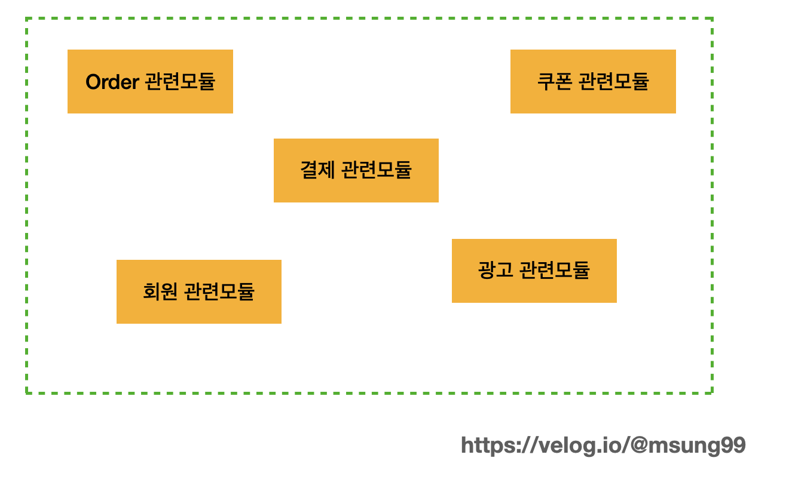

# 배열(Array) 이란?

### 배열(Array) 이란?

배열은 연관된 데이터를 모아서 관리하기 위해서 사용되는 데이터 타입이다.

변수가 하나의 데이터를 저장하기 위한 것이라면, 배열은 여러 개의 데이터를 저장하기 위한 것 이라고 할 수 있다.


### 배열의 특징

<div align="left">

<figure><figcaption></figcaption></figure>

</div>

배열은 메모리상에 고정된 크기의 연속된 공간을 갖기 때문에 한 번 생성된 배열의 크기는 변경 할 수 없습니다.


```java
        // 기본형(primitive type)의 배열 초기화
        int[] intArray = new int[5]; // int 배열의 모든 요소는 0으로 초기화됨
        double[] doubleArray = new double[3]; // double 배열의 모든 요소는 0.0으로 초기화됨
        boolean[] booleanArray = new boolean[4]; // boolean 배열의 모든 요소는 false로 초기화됨
        
        System.out.println(Arrays.toString(intArray)); // 출력: [0, 0, 0, 0, 0]
        System.out.println(Arrays.toString(doubleArray)); // 출력: [0.0, 0.0, 0.0]
        System.out.println(Arrays.toString(booleanArray)); // 출력: [false, false, false, false]
        
        // 참조형(reference type)의 배열 초기화
        String[] stringArray = new String[2]; // String 배열의 모든 요소는 null로 초기화됨
        Object[] objectArray = new Object[3]; // Object 배열의 모든 요소는 null로 초기화됨
        
        System.out.println(Arrays.toString(stringArray)); // 출력: [null, null]
        System.out.println(Arrays.toString(objectArray)); // 출력: [null, null, null]
```


Primitive Type의 배열을 초기화하면 값이 비어있는 것이 아니라 Type별 기본 값이 저장되고, Reference Type의 배열은 기본 값인 null로 초기화됩니다.

<div align="left">

<figure><figcaption></figcaption></figure>

</div>

해당 배열의 인덱스를 통해서 메모리 주소를 알 수 있기 때문에 배열 원소에 접근할 때 O(1)의 시간복잡도를 갖습니다.


그렇다면 배열의 한계가 무엇일까?

### 배열의 한계

1. 배열을 생성할 때 정적으로 크기를 정해야한다.
   * 배열에 담을 데이터의 수가 정확하지 않을 때 크기를 정하기에 불확실성이 생김
   * 배열의 크기를 작게하면 원하는 만큼 데이터를 수용할 수 없고, 크게하면 메모리 낭비로 이어진다.
2. 배열 중간에 데이터를 삽입하거나 제거해야하는 경우가 생기는데 배열은 변경만 가능하다.
3. 배열은 원소 값을 중복없이 관리하기 힘들다.
